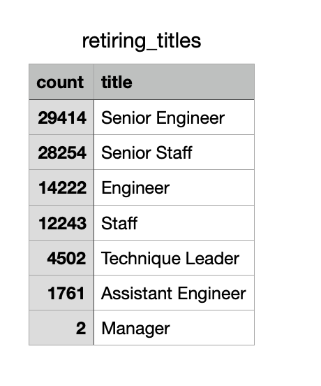
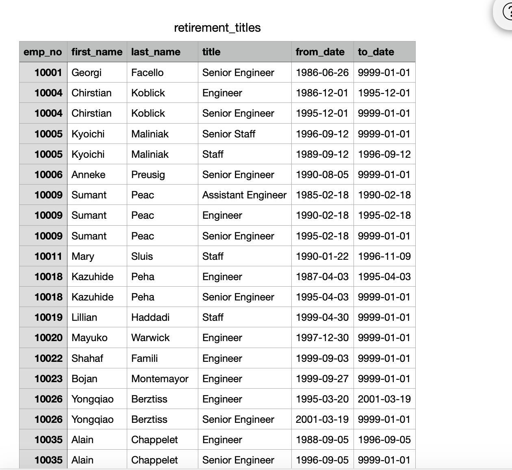
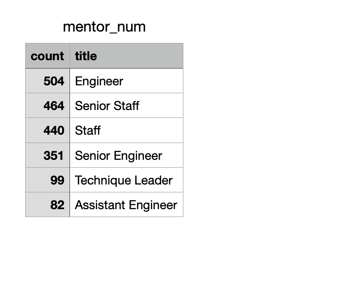

## Overview of Project

### Purpose
In this assignment, we will be helping Bobby, an SQL expert, to analyze a group of data set about the employee’s retirement information of a company called Pewlett Hackard.

Before we started our analysis, we will first give a brief introduction about the raw data sets. We are given 6 raw data sets: “departments”, “department’s employee”, “department manager”, “employee”, “salaries” and “titles”.  Each of them contain rows of information. As we skim through the data sets, we found that some columns are repeatedly showing in multiple data sets. For example the employee numbers are in the department employee sheet and department manager sheet. Thus we will be using these columns as our keys to connect between different dataset and to join and create new dataset based on the common columns.

## Results

1) According to the above graph, there is 7 titles among the people who are about to retire. Senior engineer is the title that accounts for the largest part of the retirement population, which is 29414. Senior staff ranks as the second largest number of retiring people, which is 28254. There is only 2 manager roles will be available.

2) According to the above graph, many people have or had multiple roles or titles during the time they served in this company. 

3) We created a new table, mentor_num, based on the mentorship eligibility table. According to the new table, we can find that there is 504 engineers can be eligible to participate the mentorships program, 464 senior staff and 440 staff can be part of this program. 
4) We notice that 0 manager role can be qualified to participate this program. We have doubt that whether there will be enough manager to participate in the mentorship program.

## Summary 

As we mentioned before, we created a table called mentor number based on the mentorships eligibility table. We can use this table to determine for each title how many people can participate in this year’s mentorship program. 

We will also suggest to create a table that can indicate how many roles each person have during their services at the company. For example in the retirement_title table, we can find that the person called Sumant Peac started his career as an asssistant engineer to senior engineer. By understanding how many roles each person have, we can help the new generation better to achieve their long term career goals as we can mentor their to plan a realistic career path.

### How many roles will need to be filled as the "silver tsunami" begins to make an impact?

According to the above graph, there will be a total of 90398 roles need to be filled.

### Are there enough qualified, retirement-ready employees in the departments to mentor the next generation of Pewlett Hackard employees?
According to the mentor_num table, there will be people for each of the titles except for the manager role. There is 0 manger can participate for this program, thus we concern if there is enough people to mentor for the manager role. 
